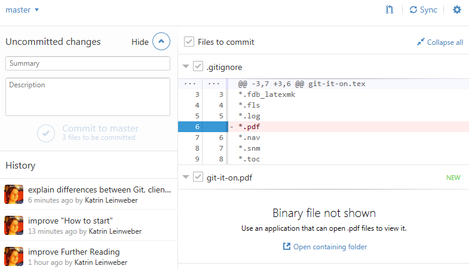

### What is evolution?

[")](http://www.mikero.com/misc/darwin/)

### Remember Ansgar's "Tree of Life"-talk?

[")](http://www.thecoast.ca/halifax/doolittle-darwin-and-the-deeply-dumb/Content?oid=1320808)

### What is evolution? Inheritance of genetic changes.

[ Horizontal gene transfer: perspectives at a crossroads of scientific disciplines")](http://www.nature.com/nrmicro/journal/v3/n9/fig_tab/nrmicro1253_F1.html)

### Projects evolve, too! Largey digitally.

### Git helps track such changes.

> - commenting => easy-to-understand description/summary of change(s)
> - [mathematic verification](http://git-scm.com/book/en/v2/Getting-Started-Git-Basics#Git-Has-Integrity) => nothing can change without Git noticing it
> - automatic visualisation => quick reminder of what you did

### Git helps track such changes. Is your file watchdog!

### What is Git?

> [A] free and open source distributed version control system designed to handle everything from small to very large projects with speed and efficiency. ([git-scm.com](http://git-scm.com/))

### What is Git?

> [A] free and open source distributed version control system designed to **handle everything** from small to very large projects with speed and efficiency. ([git-scm.com](http://git-scm.com/))

#### all types of files

> - very useful for text files (TXT, R, etc.)
> - medium useful for images (JPG, PNG, etc.)
> - not useful for complex files (DOC, XLS, PDF, etc.) => .gitignore
> - DEMO: `F0-legends > initial` & `150224-30m > final`

### What is Git?

> [A] free and open source distributed **version control** system designed to handle everything from small to very large projects with speed and efficiency. ([git-scm.com](http://git-scm.com/))

#### control over document versions

> - record, comment & highlight changes
> - revert old changes & restore old file versions
> - per line if necessary => better than backup or wiki
> - DEMO: `F0-legends > moved incubation times...` 

### What is Git?

> [A] free and open source **distributed** version control system designed to handle everything from small to very large projects with speed and efficiency. ([git-scm.com](http://git-scm.com/))

#### asynchronous team-work

> - entire database of project history is stored in each project folder
> - sync changes via Git server (like comments in JPY-PDF)
> - collisions only if same lines are edited (Dropbox?)
> - DEMO: `Paper-Now-Achmi...`

### Good against: too many files

### Good against: unnamed versions

### Good for: clean view on files plus accessible version history 

### Good for: clean view on files plus accessible version history 

### Basic vocabulary

- **repository/repo:** Git's database of file versions in a watched folder

### Basic vocabulary

- **commit:** set of logically connected changes within same (or across different) file(s) that are checked into the repository

### Basic vocabulary

- **.gitignore:** file in which files and file types are listed that Git should ignore

### Advanced vocabulary

> - **branches:** different contexts in same repository (cheaply created for a side experiment & then either merged or deleted)

### Advanced vocabulary

> - **switching branches:** letting Git serve only the files in that branch to you
> - **merging:** integration of changes from one branch into another
> - DEMO: `Git it on > experiments`

### Summary of Git's properties

#### Technically

> - works very well for text, semi-well for images
> - gives you control over, and knowledge plus proof of, file changes
> - gratis backup & cheap syncing

#### Culturally

> - enables precise documentation (for colleagues, students, reviewers, your future self, etc.)
> - ultimately eases collaborative work on same set of files
> - teaches basics of best software tools

### How to start using it?

> 1. download client from [windows.github.com](https://windows.github.com/) (any other from [git-scm.com/downloads/guis](http://git-scm.com/download/gui/win)) & install
> 1. wait for new, small sub-project (bioinformatic script, diagram in R, report, etc.)
> 1. drag project folder into GitHub client to initialise the repo
> 1. edit, add & delete files as before
> 1. **but:** commit logically connected changes often to
> 1. **recommended:** start writing text in .markdown or .txt, instead of .docx
> 1. **optional (enables collaboration, off-site backup, publishing, etc.):** wait for [git.uni.kn](https://git.uni-konstanz.de/users/sign_in) or create account at [GitLab](https://gitlab.com/users/sign_in), [GitHub](https://github.com/join), [BitBucket](https://bitbucket.org/account/signup/) & push/sync your local repo

### A word on Git, Git clients and Git hosting services

### A word on Git, Git clients and Git hosting services

> - Git = the software itself, accessible only through **c**ommand **l**ine **i**nterface
> - Git client (like GitHub for Windows) = **g**raphical **u**ser **i**nterface presents Git's functions nicely in buttons etc.
> - Git hosting service = remote copy of repos, plus discussions, wiki, auto-publishing etc.

### Questions?

### Thanks to & Further Reading

- "[Scientific Markdown](https://github.com/JensErat/scientific-markdown)" by Jens Erat
- "[Git for Scientists](https://mollygibson.github.io/2014-08-11-wustl/lessons/git-notebook/git-for-scientists.slides.html)" by [Molly Gibson](https://github.com/mollygibson)
- "[Git/GitHub: a Primer for Researchers](http://datapub.cdlib.org/2014/05/05/github-a-primer-for-researchers/)" by [Carly Strasser](http://carlystrasser.net/)
- "[We Need a Github of Science](http://marciovm.com/i-want-a-github-of-science/)" by [Marcio von Muhlen](https://twitter.com/marciovm)
- "[10 Years of Git: An Interview with Git Creator Linus Torvalds](https://www.linux.com/news/featured-blogs/185-jennifer-cloer/821541-10-years-of-git-an-interview-with-git-creator-linus-torvalds/)" by [Jennifer Cloer](https://twitter.com/JenniferCloer)
