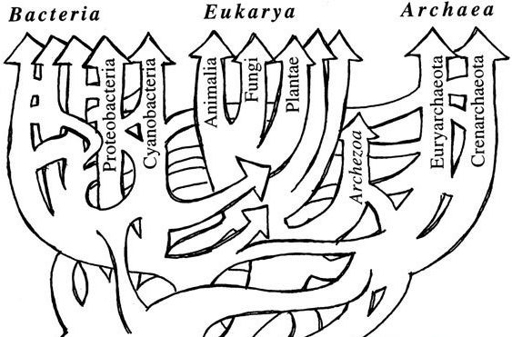
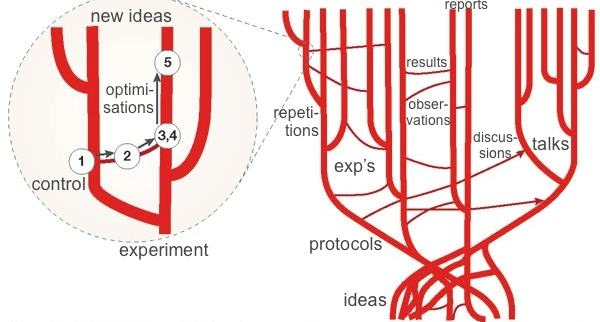
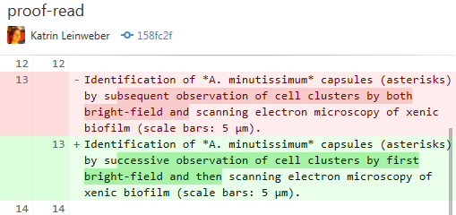
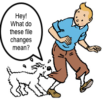
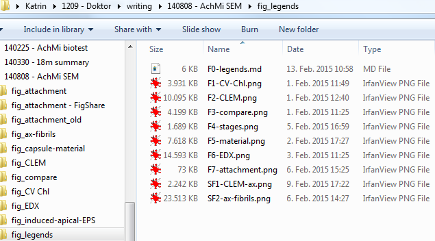
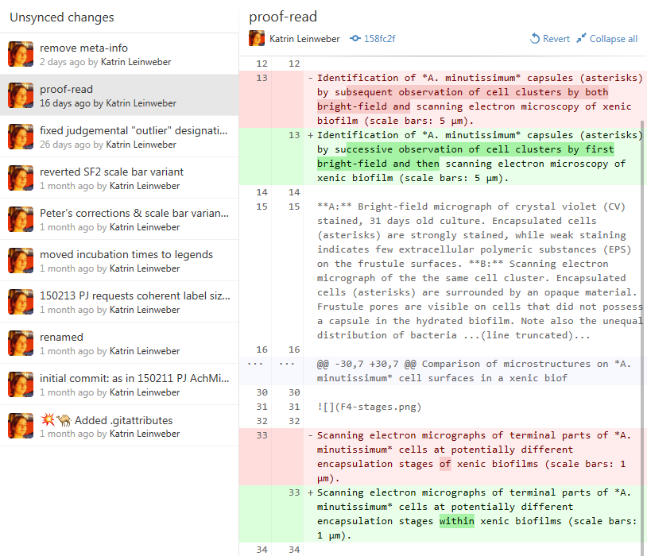
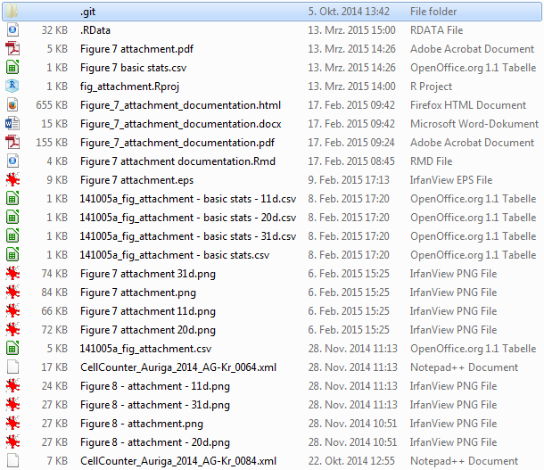
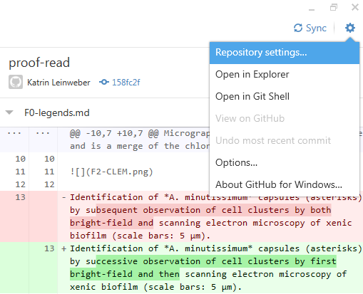

### Tree of Life

### Tree of Life

[ Horizontal gene transfer: perspectives at a crossroads of scientific disciplines")](http://www.nature.com/nrmicro/journal/v3/n9/fig_tab/nrmicro1253_F1.html)

### Tree of Projects

### Git can help track the digital evolution of your project(s).

> - automatic, line-by-line highlighting of what exactly was/has changed
> - incentivised commenting of file changes

### Git is your file watchdog.

### Good against: too many files

### Good for: tidy project folders, but...

### Good for: ...version history still accessible

### Summary of Git's properties

#### Technical

> - works best for line- or paragraph-based files
> - built for source code, but also useful for texts and simple images
> - less useful for complex or large file types => no backup replacement!

#### Cultural

> - helps build self-explanatory & verifiable project documentation (for your future self, colleagues, students, reviewers...)
> - enables less painful collaboration on same set of files
> - causes conflicts only if same lines in same file get changed (better syncing of text files)

### Basic Git vocabulary: repository/repo

> - project folder watched by Git
> - continue adding, editing & deleting files
> - database of file versions in hidden `.git` subfolder

### Basic Git vocabulary: committing

> - saving a set of logically connected file change with meaningful commit message
> - changes can be within single file, or across different ones
> - **commit history:** self-explanatory & verifiable documentation
> - DEMO: `fig_legends > initial` & `Zotero-styles > secure DOI`

### Basic Git vocabulary: .gitignore

> - file that contains a repo's rules for ignoring files 
> - No preview of highlighted changes? Large file? Auto-generated? Rather ignore those!
> - DEMO: `30m summary > ignore all *.docx` & `Git it on > unignore *.pdf`

### Basic Git vocabulary: .gitignore in GitHub for Windows

### Advanced Git vocabulary: branching

> - creating new context within repo => files can evolve differently
> - **switching branches:** updates file states in project folder
> - **merging:** integrates changes into other branch (per line)
> - DEMO: `Git it on > experiments`

### Vocabulary summary

#### repository/repo

- project folder watched by Git, plus hidden database of file versions

#### committing

- composing logically connected file changes and meaningful commit message

#### .gitignore

- a repo's ignore rules for non-essential files & file types

#### branches

- different contexts for file evolution and status within same repo

### How to start using Git?

> 1. download client from [windows.github.com](https://windows.github.com/) (any other from [git-scm.com/downloads/guis](http://git-scm.com/download/gui/win)) & install
> 1. start with small sub-project (protocol optimisation, diagram in R, report, etc.)
> 1. **besides working on the files themselves:** commit logically connected changes often
> 1. **recommended:** start writing texts in Markdown[^1] format
> 1. **optional (for collaboration etc.):** create account with Git hosting service like [GitLab](https://gitlab.com/users/sign_in)[^2] or wait for [git.uni.kn](https://git.uni-konstanz.de/users/sign_in) 

[^1]: Possible in Word with [Writage](http://www.writage.com/) add-in
[^2]: [GitHub](https://github.com/join) wants $ for private repos, but client is free & compatible with other Git services

### Thanks for your attention! Questions?

### Further Reading

- "[Scientific Markdown](https://github.com/JensErat/scientific-markdown)" by Jens Erat
- "[Markdown Basics](https://help.github.com/articles/markdown-basics/#basic-writing)" and "[Mastering Markdown](https://guides.github.com/features/mastering-markdown/)" tutorials by [GitHub](https://github.com/)
- "[Git for Scientists](https://mollygibson.github.io/2014-08-11-wustl/lessons/git-notebook/git-for-scientists.slides.html)" by [Molly Gibson](https://github.com/mollygibson)
- "[Git/GitHub: a Primer for Researchers](http://datapub.cdlib.org/2014/05/05/github-a-primer-for-researchers/)" by [Carly Strasser](http://carlystrasser.net/)
- "[We Need a Github of Science](http://marciovm.com/i-want-a-github-of-science/)" by [Marcio von Muhlen](https://twitter.com/marciovm)
- "[10 Years of Git: An Interview with Git Creator Linus Torvalds](https://www.linux.com/news/featured-blogs/185-jennifer-cloer/821541-10-years-of-git-an-interview-with-git-creator-linus-torvalds/)" by [Jennifer Cloer](https://twitter.com/JenniferCloer)
- "[Learn Version Control with Git](http://www.git-tower.com/learn/ebook/mac/basics/why-use-version-control#start)" tutorials by [Forunova](http://www.fournova.com/)
