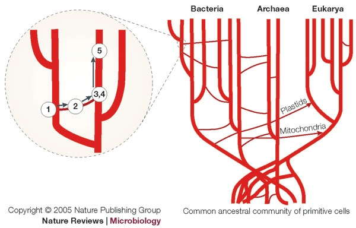
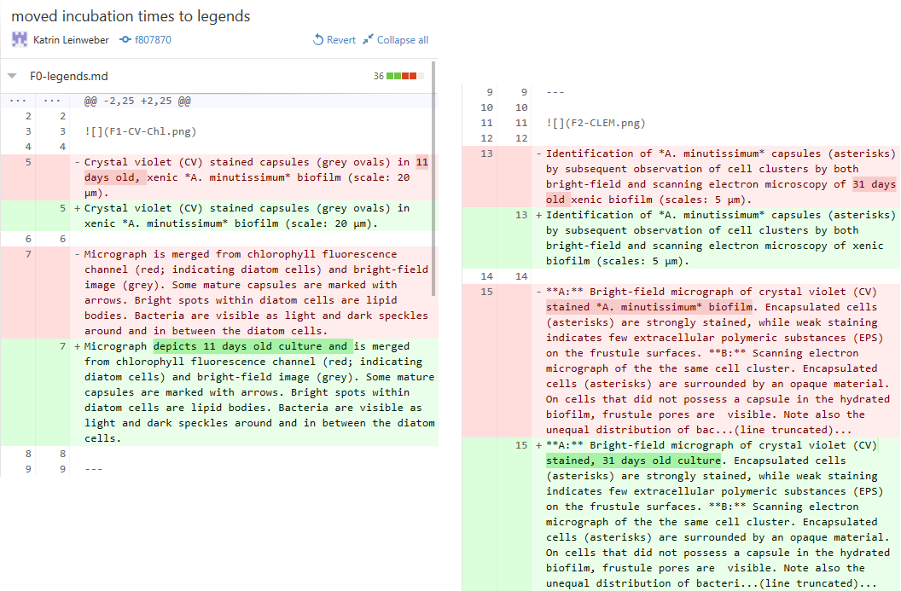

### Remember Ansgar's "Tree of Life"-talk?

> Tim Bousquet (The Coast, 2009-Oct-8) [Doolittle, Darwin and the Deeply Dumb](http://www.thecoast.ca/halifax/doolittle-darwin-and-the-deeply-dumb/Content?oid=1320808)

### Remember Ansgar's "Tree of Life"-talk?

> Smets & Barkay (2005) [Horizontal gene transfer: perspectives at a crossroads of scientific disciplines](http://www.nature.com/nrmicro/journal/v3/n9/fig_tab/nrmicro1253_F1.html)

### What is evolution?

Changes, that are chronologically ordered by inheritance.

### Projects live & evolve, too!

> 1. wild type organism => transformation => knock-out mutant
> 1. experiments => results & observations
> 1. discussions & writing => plans for next experiment

### A lab journal therefore needs:

> 1. chronological, verified order => achieved on paper with page numbers
> 1. highlighting of changes => colors

> - but can't be shared

### What is Git?

> [A] free and open source distributed version control system designed to handle everything from small to very large projects with speed and efficiency. ([git-scm.com](http://git-scm.com/))

### What is Git?

> [A] free and open source distributed **version control** system designed to handle everything from small to very large projects with speed and efficiency. ([git-scm.com](http://git-scm.com/))

**control over document versions:**

> - record & comment changes
> - display change history
> - reverting old changes
> - per line if necessary => better than normal backup systems

### What is Git?

> [A] free and open source distributed version control system designed to **handle everything** from small to very large projects with speed and efficiency. ([git-scm.com](http://git-scm.com/))

**Works with all filetypes**

> - like good backup system
> - very useful for line- or paragraph-based files
> - medium useful for figures
> - not useful for big, non-text, or auto-generated files

### What is Git?

> [A] free and open source **distributed** version control system designed to handle everything from small to very large projects with speed and efficiency. ([git-scm.com](http://git-scm.com/))

**asynchronous team-work**

> - entire database of project history is stored in each project folder
> - sync changes via Git server (like comments  in JPY-PDF)
> - public & private servers available
> - collisions only if same lines are edited (Dropbox?)

### Summary of Git's properties

#### Technically

> - works with any type of file, esp. basic text
> - gives you control over, and knowledge plus proof of, file changes
> - gratis backup & cheap syncing

#### Culturally

> - enables precise documentation (for colleagues, students, reviewers, your future self, etc.)
> - teaches basics of best software tools
> - ultimately eases collaborative work on same set of files

### Good against: Too many files.

### Good against: Unnamed versions.

### Good for: Documentation.

### Basic vocabulary

- **repository** = Git's database of file versions in a watched folder

### Basic vocabulary

- **commit** = set of logically connected changes within same (or across different) file(s) that are checked into the repository

### Advanced vocabulary

> - **branches** = different contexts in same repository (cheaply created for a side experiment & then either merged or deleted)

### Advanced vocabulary

> - **switching branches** = letting Git serve only the files in that branch to you
> - **merging** = integration of changes from one branch into another

### How to start using it?

> 1. Wait for small, new project (report, diagram in R
> 1. Download a Git client (for example from windows.github.com, or check [git-scm.com/downloads/guis](http://git-scm.com/download/gui/win)) & install
> 1. create new folder initialise it as a repository
> 1. start adding files & editing them
> 1. commit logically connected edits and changes 
> 1. *Optional* (for collaboration, off-site backup, publishing, etc): create account with a Git-hosting service like [GitLab](https://gitlab.com/users/sign_in), [GitHub](https://github.com/join), [BitBucket](https://bitbucket.org/account/signup/)*

- [ ] or at [git.uni.kn](https://git.uni-konstanz.de/users/sign_in)

### Demo: Collaboration

### The End

See also my [Introduction to Digital Lab Journalling](http://prezi.com/p_se6nkre49m/digital-lab-journalling-intro/).

### To do

- [ ] "image credit" section
- [ ]
